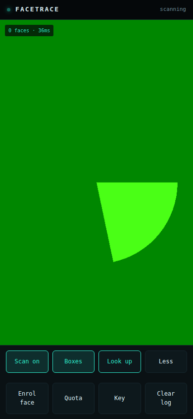
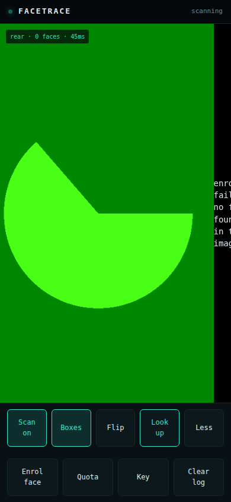
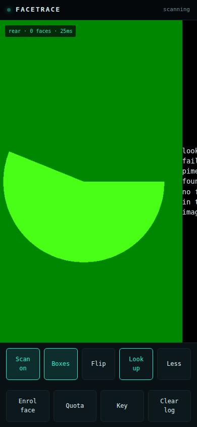
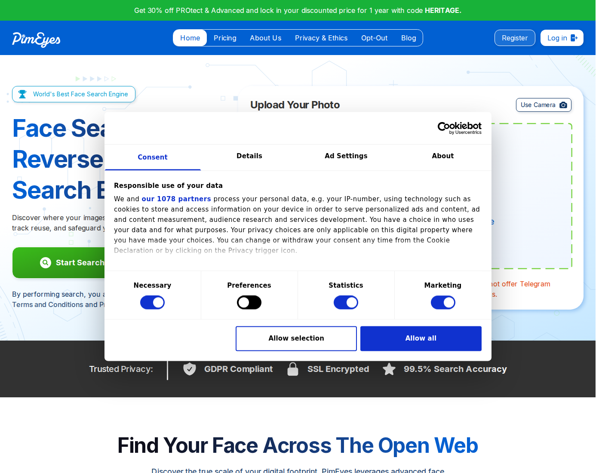
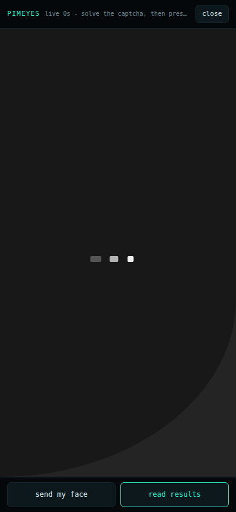

# facetrace

**A real-time face detection and matching rig, built to run from a phone browser.**

[](#status)
[](#the-fast-path)
[](#the-fast-path)
[](#the-fast-path)
[](LICENSE)

The device in your pocket becomes a face detection and matching terminal. A camera
frame is detected, embedded and matched against a local identity index in **26-38 ms**
per frame end to end, which is what makes a live overlay possible on a phone.

There are two matching stages and they are deliberately separate. The fast path runs
entirely on the host and compares against an index you build yourself. The second stage
exists but is fenced off behind its own button, because it asks somebody else's search
engine about a face you chose to send.

> **Authorised use only.** Enrolling and matching faces of people who have not consented
> is unlawful in most jurisdictions, including under the GDPR. The local index holds only
> faces you enrol deliberately. Nothing here indexes the public internet.

---

## Screenshots

**Phone capture page** - live detection overlay, enrolled identity labels, confidence readout.



**Enrolment** - an enrolled identity is confirmed on the camera view, not buried in a log.



**Lookup verdict** - the second stage reports its own outcome honestly, including refusals.



---

## The fast path

```
 camera frame
      |
      v
  YuNet detector  ──▶  face box + five landmarks
      |
      v
  SFace encoder   ──▶  128-d embedding
      |
      v
  cosine match against data/index.json
      |
      v
  overlay: label + confidence, ~26-38 ms/frame
```

Both models are OpenCV's own — `cv2.FaceDetectorYN` (YuNet) for detection and
`cv2.FaceRecognizerSF` (SFace) for the embedding. They are ONNX graphs run on the CPU
through the DNN module; there is no GPU, no cloud call and no per-frame cost beyond the
arithmetic. That is the entire reason the live overlay is viable.

The matcher is a cosine similarity against the enrolled embeddings, with the
**0.363 same-identity threshold** published with the SFace model. Scores are reported
as a percentage on the face box.

### Measured behaviour

| Check | Result |
|---|---|
| Full detect + embed + match, per frame | 26-38 ms |
| Same face, exact duplicate image | 1.00 cosine |
| Same face, resized / brightened / cropped / recompressed | ~0.93 cosine, matched |
| Different person | below 0.363 threshold, no match returned |

---

## The second stage



The `Look up` button is a separate, explicitly pressed action. It is not part of the
live loop and it is not required for the rig to work.

The upstream service publishes no API. What exists is their web application, and it
has two doors that this module walks in order:

**Door one — the face endpoint.** `POST /api/face` accepts an image as base64 and returns
the face hash and crop it assigns. No browser, no captcha and no account are involved.
The Cloudflare `__cf_bm` cookie has to be collected from the homepage first, or the call
returns 404; `lookup.py` does that before it posts.

**Door two — starting the search.** This is gated behind a Prosopo captcha session and a
Cloudflare bot check, neither of which can be solved server-side. The module therefore
drives a **real headless Chromium through Playwright**, detects which of the two it is
facing, and reports the verdict either way. `captcha.py` pierces the widget's double
shadow DOM, reads the grid with a vision model, and clicks the cells.

| Constraint | Value |
|---|---|
| Search budget | ten searches per IP per day, read live by the `Quota` button |
| Latency | tens of seconds per attempt |
| Durability | one upstream markup change from breaking |
| Blocking factor | IP reputation — the bot wall is served before the widget opens |

A third mode drives the same solver against a **persistent live browser** rather than a
headless one, so a human can click through what the solver cannot.



---

## What this is not

There is no capability here to identify an unknown person from a public database.
Nothing in this repository crawls, scrapes or indexes the internet for faces. The local
index contains only the embeddings you created by enrolling someone. The second stage is
you asking a third-party engine about one face you deliberately submitted to it.

Running live identification against people in public would require a lawful basis that
this project does not have and is not seeking. The techniques are documented so that
biometric-matching systems can be understood and evaluated, in the same way the other
repositories here document offensive tooling for defensive readers.

---

## Repository layout

| File | Role |
|---|---|
| `app/engine.py` | Detection and embedding. YuNet + SFace, the local cosine index, enrol / match / clear. |
| `app/lookup.py` | The two upstream doors, the bot-wall detection, and the premium-key interface. |
| `app/captcha.py` | Prosopo solver: shadow-DOM piercing, vision-model grid reading, click dispatch. Never raises. |
| `app/live.py` | Attaches to the running Chromium over CDP so the solver can run in the visible session. |
| `app/server.py` | Starlette API. Blocking browser work is dispatched off the event loop. |
| `app/ui.html` | The phone page. Camera, overlay, enrol, lookup, live view, quota. |
| `data/models/` | `yunet.onnx`, `sface.onnx` — fetched from the OpenCV model zoo. |
| `data/index.json` | Enrolled identities: name, embedding, enrolment time. |

---

## API

| Method | Endpoint | Purpose |
|---|---|---|
| `GET` | `/health` | Liveness |
| `GET` | `/api/quota` | Searches remaining today, read live |
| `POST` | `/api/scan` | Fast path: boxes plus local matches for one frame |
| `POST` | `/api/lookup` | Second stage: the upstream search, `full=1` to actually attempt it |
| `GET` | `/api/index` | List enrolled identities |
| `POST` | `/api/index` | Enrol a face under a name |
| `POST` | `/api/index/clear` | Empty the index |
| `GET` | `/api/settings` | Whether a premium key and endpoint are configured |
| `POST` | `/api/settings` | Store a premium key and endpoint |
| `POST` | `/api/live/start` | Start the persistent Chromium session |
| `POST` | `/api/live/solve` | Run the solver against the live session |

---

## Running it

```bash
python -m uvicorn app.server:app --host 127.0.0.1 --port 18500 --workers 2
```

Two workers is not a tuning preference. The second stage blocks for up to seventy-five
seconds while it drives a browser, and with a single worker every `/api/scan` frame
queues behind it and times out — the camera freezes at roughly 500 ms per frame. The
blocking calls are additionally dispatched with `asyncio.to_thread` so they never
occupy the event loop. Both measures are needed; either alone is insufficient.

The models are expected at `data/models/`. There is no sound, no GPU and no external
service required for the fast path — it runs on a CPU-only host.

### On a phone

The camera requires a secure context: it works over HTTPS or on `localhost`, never over
plain HTTP on a LAN address. Added to the home screen it opens fullscreen without
browser chrome.

---

## Status

**Tested and measured:** the fast path end to end, the local index (enrol, match,
persist, clear), the frame budget under concurrent load, the two-worker fix for the
camera stall, and the bot-wall-versus-widget detection.

**Working but fragile by nature:** the second stage. It is a solver driving a site that
does not want to be driven, and it is honest about which wall it hit rather than
reporting a generic failure. From a datacentre IP the widget frequently never opens at
all — the bot check is served first, and that is an IP reputation problem no client-side
solver can fix. A residential or mobile egress is the only real remedy, and it is not
included here.

**Accuracy claim, bounded:** the 0.93 figure is against a deliberately transformed copy
of the same photograph. Recognition across different lighting, age or angle is not
measured by this suite and should not be inferred from it.

---

## Licence

MIT. See [LICENSE](LICENSE).
